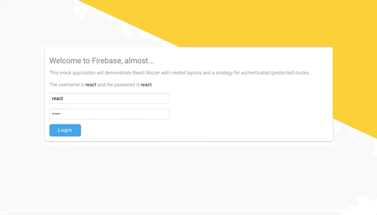

# React Router 5 Course Material

React Router 5 is out and we have created this course so you can learn all about it. The course covers basic and advanced topics. We'll be building a Firebase-looking app that has complex nested layouts and interesting problems to solve.



## What's New?

If you're wondering what's new in React Router 5? Not a lot, except internal optimizations and fixes for React 16.x. So you could also think of this as a React Router 4 course since the API is the same. [See more info on the React Router 5 release](https://reacttraining.com/blog/react-router-v5/).

## Download and Install

After downloading the repository from Github, enter the following commands into your command line from the project folder:

```bash
npm install
npm start
```

Then go to [localhost:8000](http://localhost:8000)

> Be sure to see notes on Lesson Branches below...

## Each Lesson is a Git Branch

To view the code for a given lesson, _checkout_ the appropriate branch name. The branch will have the finished code from that lesson.

### Installing lesson branches

All the branches are checked out to your local machine automatically when you do `npm install`. Just do a `git branch` to verify and see all branches after. If they didn't appear, try running `npm run branches` to download all the branches.

To view a branch: `git checkout [branch-name]`

<hr />

Branch names are minimal for easy typing:

- **01-basics** - JSX Routing with `BrowserRouter` and `Route`
- **02-basics** - Route Matching - Inclusive vs Exclusive (exact) and Switch
- **03-basics** - `Link` (anchors)
- **04-basics** - `BrowserRouter` vs `HashRouter`
- **05-basics** - Dynamic (Parameter) Matching
- **06-basics** - Nested Layout Strategy
- **07-basics** - `match.url`
- **08-basics** - `match.path`
- **09-basics** - `NavLink`
- **10-basics** - `withRouter` HoC
- **11-basics** - Programmatic Navigation (History Object)
- **12-basics** - URL Query Strings
- **13-advanced** - Route Render Methods
- **14-advanced** - React Router - Just Components ™
- **15-advanced** - Authentication Strategy with Context
- **16-advanced** - Authenticated Routes (Dynamic Routes)
- **17-advanced** - Navigation With State
- **18-advanced** - Prompt Before Route Changes
- **19-advanced** - Animating Route Changes (Part One)
- **20-advanced** - Animating Route Changes (Part Two)

## Fake Database

Just so we can mimic some data and pretend it's asynchronous, there's a `src/database.json`. Feel free to add more "Firebase Projects" if you want.

## The CSS

I used `className`. Who cares, it keeps the styling clutter out of the JS files since this is teaching material for routing.

## Code Organization

In `/src` you'll see:

- `layouts` for highly re-usable app-wide layouts
- `styles` for Sass modules
- `ui` is where I like to put re-usable "leaf-types" of components
- `utils` is a catch all for React components that are more utilitarian in nature (and less UI in nature) and other general utils.

Any other folders in `/src` is a section of the site, like `/auth` and `/projects` which correspond to `localhost:8000/auth` etc. I guess I could organize those into a `/pages` folder, but who likes deep nesting anyways?
